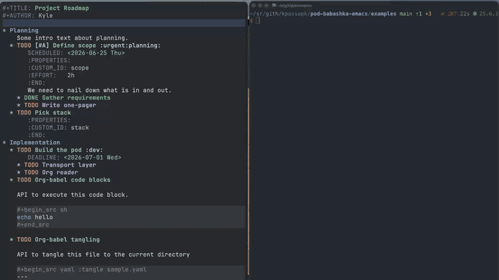
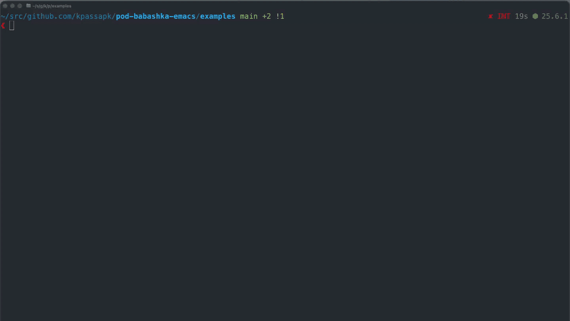
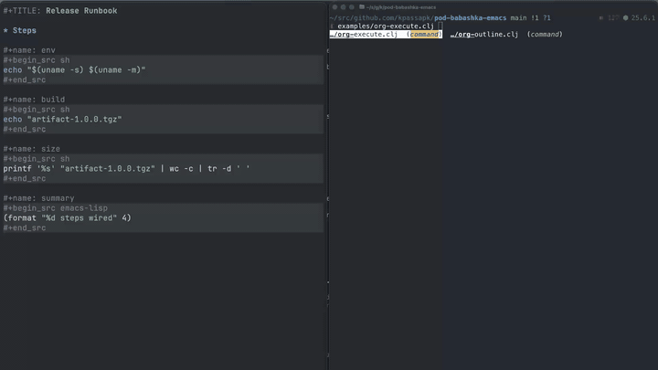

# Examples

```
bb org-portal.bb
```

Turn org mode documents into Clojure data structures



```
bb calc-units.bb
```

A unit converter using calc.



```
bb editor.bb <FILE>
```

An editor (!)


run org-mode source code blocks from bb

```
bb org-tui.bb
```


