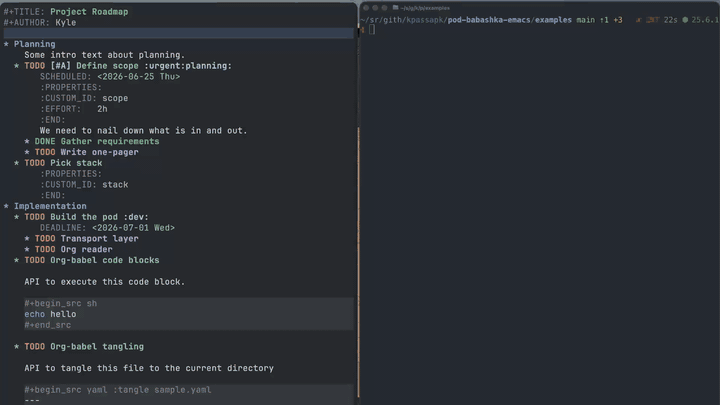
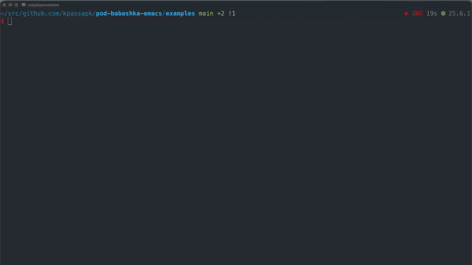
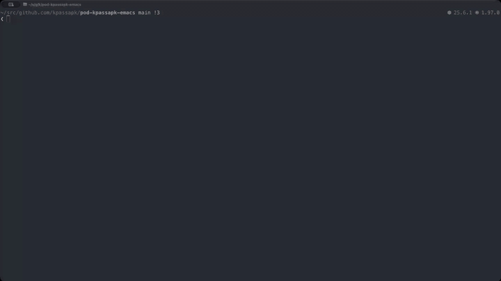
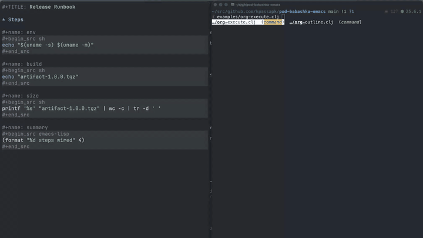

# Examples

```
bb org-portal.bb
```

Turn org mode documents into Clojure data structures, read through
[cljbang-org](https://github.com/kpassapk/cljbang-org) via `clj!`.



```
bb calc-units.bb
```

A unit converter using calc.



```
bb editor.bb <FILE>
```

An editor (!)



Run org-mode source blocks and `#+call:` lines from bb, through
[cljbang-org](https://github.com/kpassapk/cljbang-org).

```
bb org-tui.bb [FILE]
```

`FILE` defaults to [runbook.org](runbook.org). A runbook is the TUI's
input, not a script: `bb runbook.org` won't run it.


